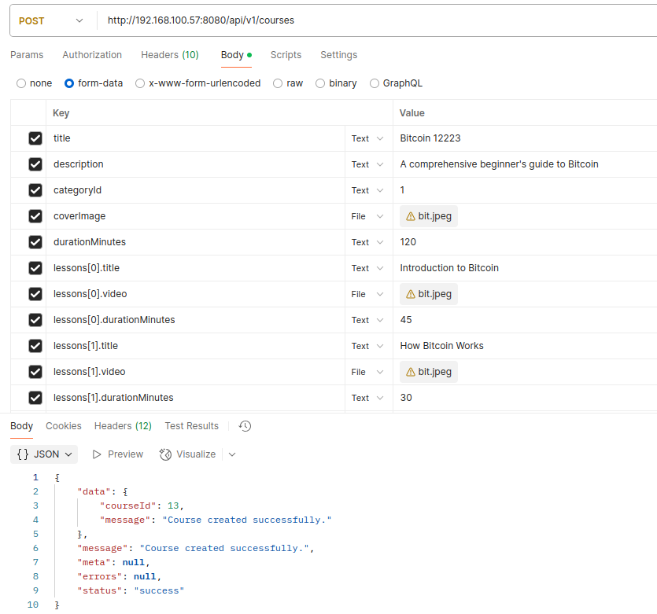

# @ModelAttribute
- The `@ModelAttribute` method parameter annotation binds request parameters, URI path variables, and request headers onto a model object.

## If API requirement is like:
```curl
POST /api/v1/courses
Content-Type: multipart/form-data

title: Bitcoin 101
description: A comprehensive beginner's guide to Bitcoin
category_id: 1
cover_image: (file)
duration_minutes: 120
lessons[0].title: Introduction to Bitcoin
lessons[0].video: (file)
lessons[0].duration_minutes: 45
lessons[1].title: Blockchain Basics
lessons[1].video: (file)
lessons[1].duration_minutes: 50
```

### Build the DTOs first:
```java
@Getter
@Setter
public class LessonRequest {

    @NotBlank(message = "Lesson title is required.")
    private String title;

    @NotNull(message = "Lesson video is required.")
    private MultipartFile video;

    @NotNull(message = "Lesson duration in minutes is required.")
    @Min(value = 1, message = "Lesson duration must be greater than 0.")
    private Integer durationMinutes;
}
```
```java
@Data
@AllArgsConstructor
public class CourseRequest {

    @NotBlank(message = "Course title is required.")
    @Size(max = 255, message = "Course title must be at most 255 characters.")
    private String title;

    @NotBlank(message = "Course description is required.")
    private String description;

    @NotNull(message = "Category ID is required.")
    private Integer categoryId;

    private MultipartFile coverImage;

    @NotNull(message = "Duration minutes is required.")
    @Min(value = 1, message = "Course duration must be greater than 0.")
    private Integer durationMinutes;

    @Valid
    private List<LessonRequest> lessons;
}
```
```java
@Getter
@Setter
@AllArgsConstructor
public class CourseResponse {

    private Integer courseId;
    private String message;
}
```
### Create the controller method like:
```java
@RestController
@RequestMapping("/api/v1/courses")
@RequiredArgsConstructor
public class CourseController {

    private static final Logger logger = LoggerFactory.getLogger(CourseController.class);
    private final CourseService courseService;

    @PostMapping(consumes = MediaType.MULTIPART_FORM_DATA_VALUE)
    public ResponseEntity<JSONObject> createCourse(@Valid @ModelAttribute CourseRequest courseRequest) {

        logger.info("Processing course creation request.");
        try {
            CourseResponse courseResponse = courseService.createCourse(courseRequest);
            return ResponseEntity.ok(success(courseResponse, "Course created successfully.").getJson());
        } catch (IOException e) {
            logger.error("IO error while creating course: {}", e.getMessage(), e);
            return ResponseEntity.badRequest().body(error(null, e.getMessage()).getJson());
        }
    }
}
```
### Test the controller using POSTMAN not in Swagger (org.springdoc:springdoc-openapi-starter-webmvc-ui:2.7.0):

- Postman test example

