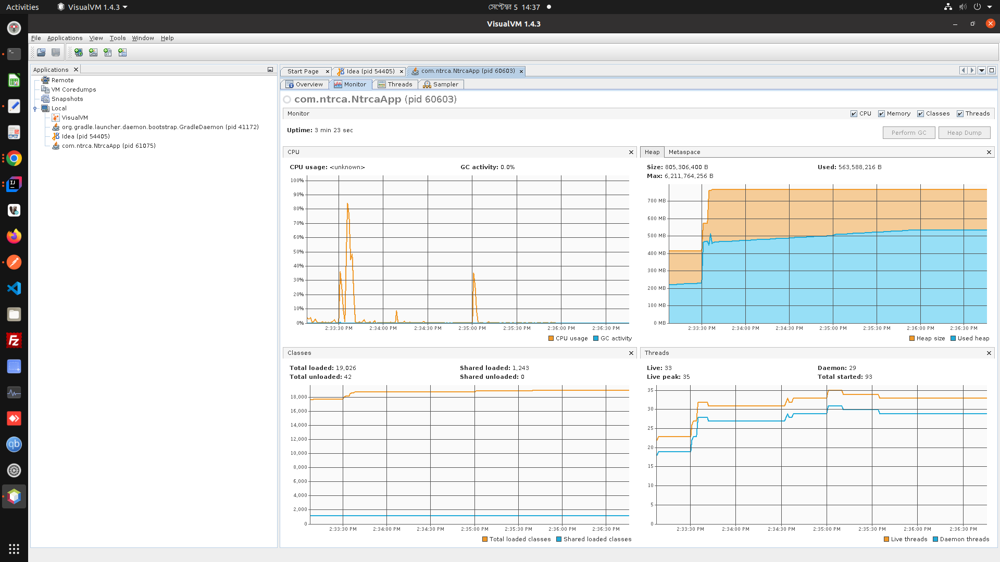
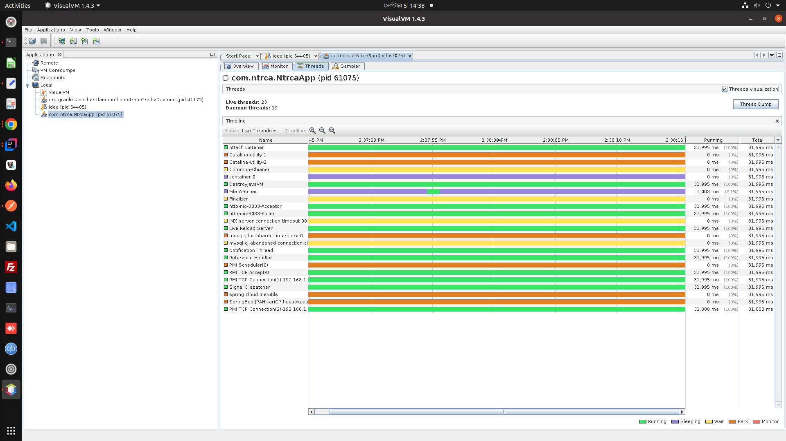
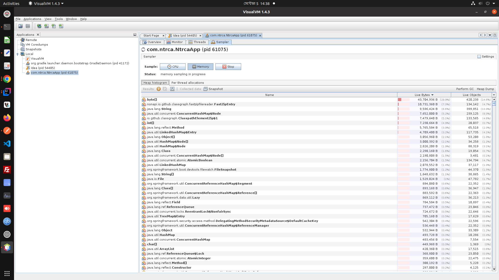

- Update the repositories using the below command
```bash
sudo apt update
```

- Install VisualVM by writing this command
```bash
sudo apt install visualvm
```
- Run VisualVM
```bash
sudo visualvm
```
- Heap Monitor panel


- Thread panel


- Memory panel

